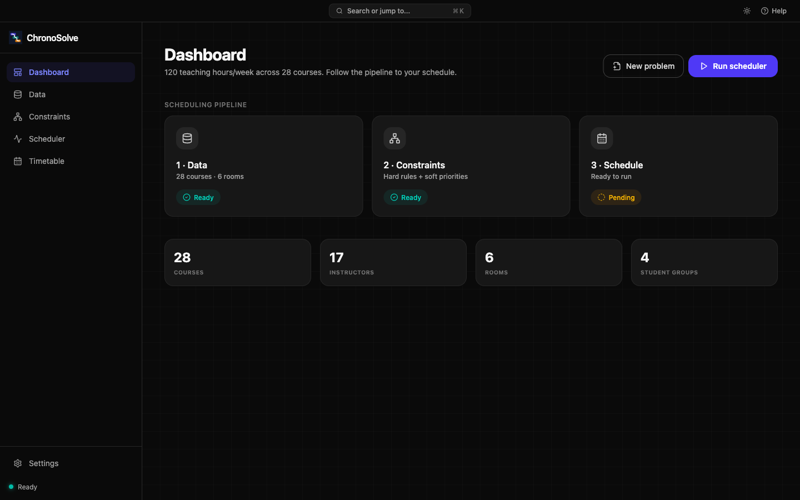
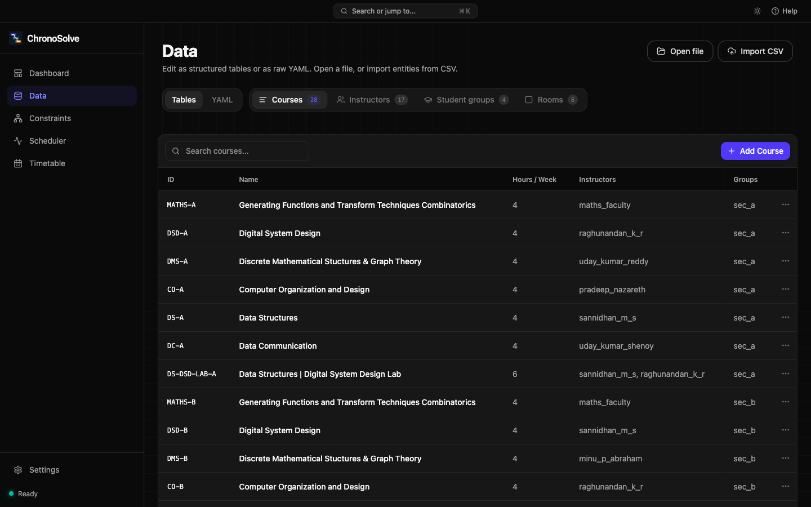
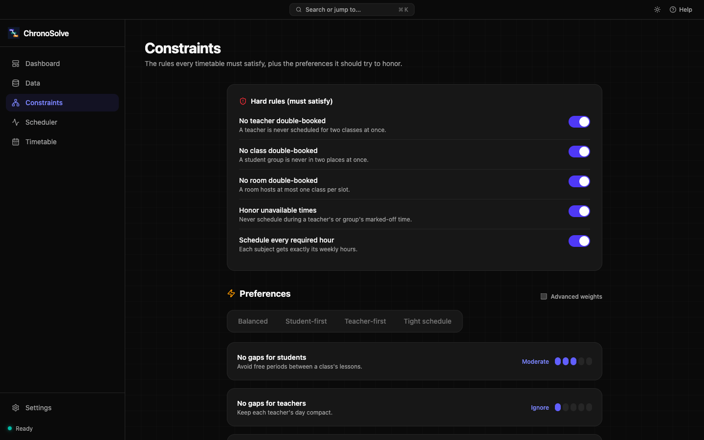
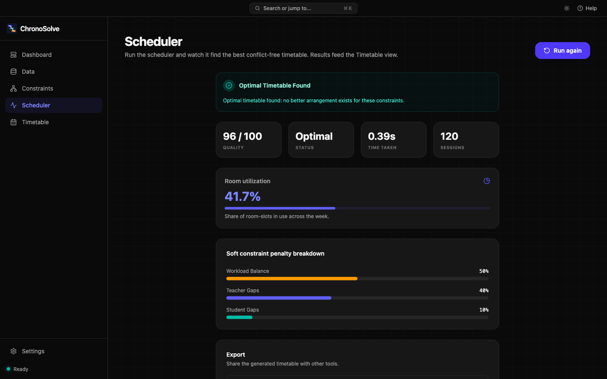
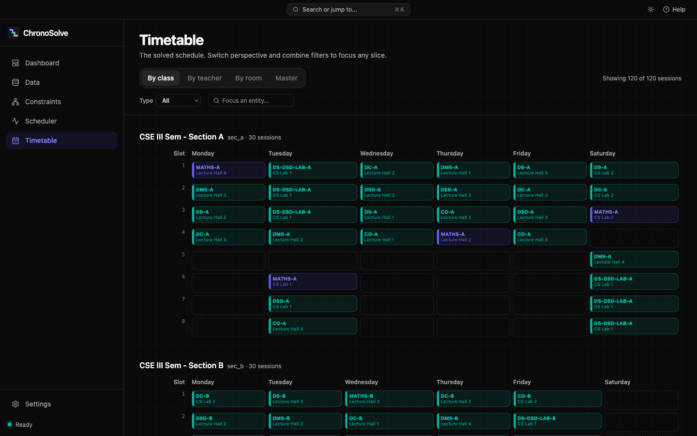

# Using ChronoSolve - a visual walkthrough

This page walks through the desktop app one screen at a time. The app also ships this same walkthrough as an interactive guided tour - on first launch a welcome card offers it, and you can replay it anytime from the **Help** menu (or press `⌘ + /` to toggle the ambient hints that label each screen).

The screenshots below use the bundled real-world example ([`examples/nmamit_cse_sem3.yaml`](../examples/nmamit_cse_sem3.yaml)): a 4-section CSE semester with 28 courses, 17 instructors, and 6 rooms.

The left sidebar follows the workflow top to bottom: **Dashboard → Data → Constraints → Scheduler → Timetable**.

## 1. Dashboard

Your home base. Start from the worked example, open a YAML/JSON file, or import CSV. Once a problem is loaded it shows live entity counts and a Data → Constraints → Schedule pipeline so you always know the next step.

## 2. Data

Edit courses, instructors, student groups, and rooms as structured tables, or switch to the raw **YAML** view to edit the definition directly. CSV import auto-matches columns, so existing spreadsheets drop straight in.

## 3. Constraints

Toggle the **hard rules** every timetable must satisfy (no double-booking, honor unavailable times, schedule every required hour), then set how much each **soft preference** matters. Quick presets - Balanced, Student-first, Teacher-first, Tight schedule - get you close in one click, and Advanced weights expose the exact numbers. Below the presets, **Advanced rules** authors institution-specific policies from plain-language templates: global breaks, allowed slots, daily teaching caps, subject sequencing, and room reservations.

## 4. Scheduler

Run the solver and watch it converge live; cancel anytime. When it finishes you get a quality score, the solve status and time, room utilization, and a soft constraint penalty breakdown - plus one-click CSV export (PDF and calendar/ICS exports are on the roadmap). If no valid timetable exists, the Scheduler names the exact rules that clash and offers a one-click **Soften to preference**: the rule becomes a weighted preference the next run honors as far as possible instead of a hard barrier.

## 5. Timetable

View the solved schedule by class, teacher, or room - or a master overview. Filter by type, department, or semester to focus any slice, and pin the sessions you want to keep if you re-run the solve.

---

A `⌘ + K` command palette, keyboard shortcuts, and a native macOS menu drive every action, and the whole app supports light and dark themes. See the [README](../README.md) for install and development instructions.
